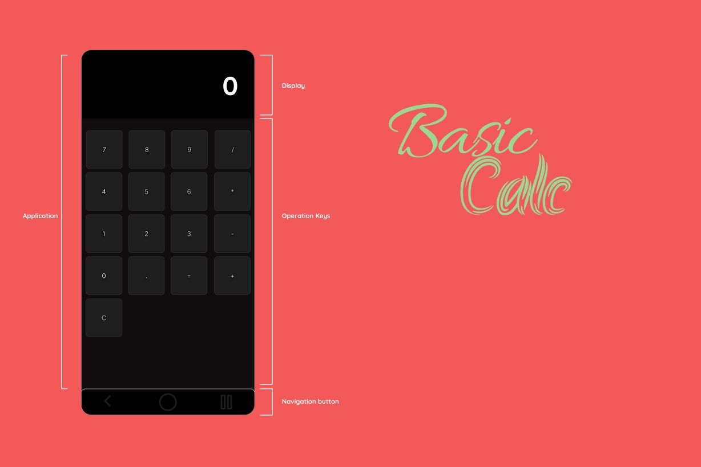

# app_alpha_mobile_utility_basiccalculator_001

- **App** → indicates that it is part of the software portfolio.
- **Alpha** → first experimental version, still in testing.
- **Mobile** → targeted at mobile devices (smartphones and tablets).
- **Utility** → a tool or helper type application, designed to make tasks easier.
- **BasicCalculator** → describes the main functionality of the application: a basic calculator.
- **001** → first unique identifier, used to differentiate this version from future releases.

## Preview

